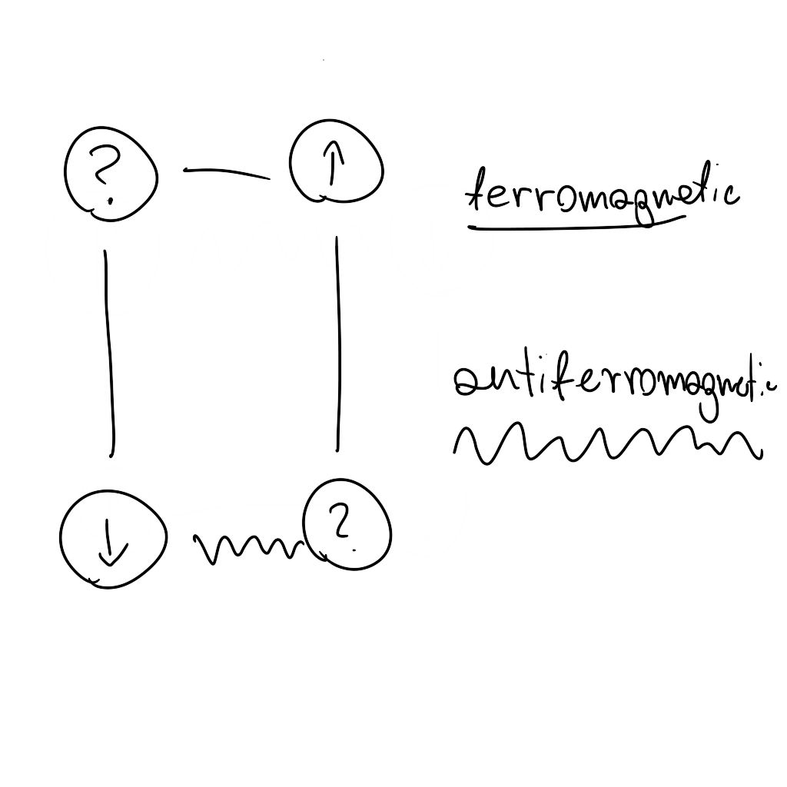
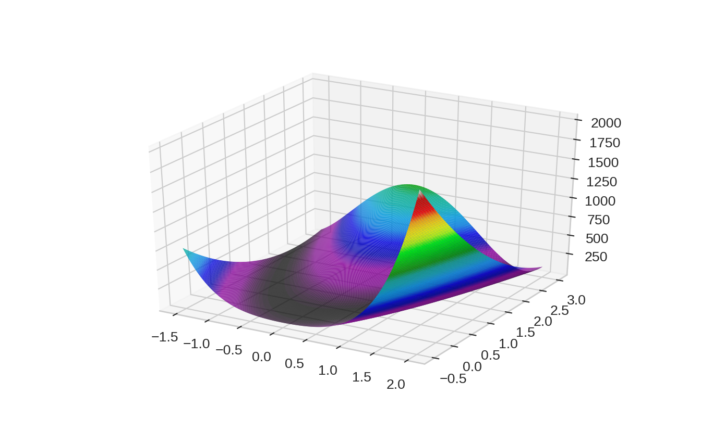

# (PART\*) Getting Started

# Introduction  {-}

## Why Care? {-}

# Necessary Context 

## Is This AI?

It's quite controversial topic . What is my take on this one? In the end it's is not relevant 

# Python Setup


```{.python .numberLines}
import numpy as np
import matplotlib.pyplot as plt
from matplotlib import cm,ticker
from mpl_toolkits.mplot3d import Axes3D

plt.style.use('seaborn-whitegrid')
```

# Benchmarks 

Four discrete problems and four continous problems.

## Discrete Optimization

### Knapsack Problem

### Traveling Salesperson Problem


```{.python .numberLines}
class TSPBenchmark():
    def __init__(self, coordinates):
        self.coordinates = coordinates
        self.distances = self.__calculate_distance(self.coordinates)
        self.n_cities = len(self.coordinates)
        self.__n_bits = int(np.ceil(np.log2(self.n_cities)))
        
    def evaluate_solution(self, solution):
        distance = 0
        for ii in range(self.n_cities-1):
            distance += self.distances[solution[ii]][solution[ii+1]]
        return(distance)
        
    def transform_bit_solution(self, bit_solution):
        #TODO optimize!
        str_gene = bit_solution.reshape(self.n_cities, self.__n_bits).astype(str)
        dec_gene = np.array([int(''.join(ii),2) for ii in str_gene])
        tour_nested = [list((np.where(dec_gene == ii)[0])) for ii in set(sorted(dec_gene))]
        flatten_tour = [ii for sub in tour_nested for ii in sub]
        return(flatten_tour)
    
    def evaluate_bit_solution(self, bit_solution):
        return(self.evaluate_solution(self.transform_bit_solution(bit_solution)))
    
    def __calculate_distance(self, coord):
        distance = np.sum((coord[:, np.newaxis, :] - coord[np.newaxis, :, :]) ** 2, axis = -1)
        return(distance)
        
    @classmethod
    def multimodal_normal(self, n_cities):
        
        mixture = [
            multivariate_normal([0, 0], [[2, 0], [0, 2]]),
            multivariate_normal([-5, 5], [[1, -0.5], [-0.5, 1]]),
            multivariate_normal([5, 5], [[1, 0.6], [0.6, 1]]),
            multivariate_normal([-5, -5], [[1, -0.7], [-0.7, 4]]),
            multivariate_normal([5, -5], [[2, -0.3], [-0.3, 2]])
        ]
        
        coordinates_list = [ii.rvs(n_cities//len(mixture)) for ii in mixture]
        coordinates_list.append(mixture[1].rvs(n_cities%len(mixture)))
        return TSPBenchmark(np.concatenate(coordinates_list))
    
    @classmethod
    def uniform(self, n_cities):
        coordinates = np.random.rand(n_cities,2)
        return TSPBenchmark(coordinates)
```


### Job Shop Scheduling

### 2D Spin Glass Ground States


```{.r .numberLines}

```

<div class="figure" style="text-align: center">

<p class="caption">(\#fig:unnamed-chunk-3)plotting example</p>
</div>

## Continous Optimization

### Rastring Function

### Rosenbrock Function


```{.python .numberLines}
class RosenbrockFunction:
	def __init__(self, a, b):
		self.a = a 
		self.b = b

	def evaluate_solution(self, x, y):
		return((self.a -x)**2 + self.b*(y-x**2)**2)
```


```{.python .numberLines}
ros = RosenbrockFunction(1, 100)
x = np.linspace(-1.5, 2, 300)     
y = np.linspace(-0.5, 3, 300)     
x, y = np.meshgrid(x, y) 
z = ros.evaluate_solution(x,y)
```


```{.python .numberLines}
fig = plt.figure() 
ax = fig.gca(projection='3d') 
ax.plot_surface(x, y, z, rstride=1, cstride=1,
  cmap=cm.nipy_spectral, linewidth=0.08,
  antialiased=True)
plt.show()
```



### Constrained Optimization 

https://cs.adelaide.edu.au/~zbyszek/Papers/p16.pdf

### Multilayer Perceptron

# Glossary

## Important Concepts

+ No-free lunch theorem

## Algorithms Abbreviations

+ *SA* - Simulated Annealing
+ *GA* - Genetic Algorithm
+ *PSO* - Particles Swarm Optimization

# (PART\*) Warming up 

# Introduction {-}

# Stochastic Hill Climbing

# Simulated Annealing 

# Adaptive SA

# Hybrid SA 

# Treshold Accepting

```
choose an initial configuration
if delta E > T
  compute delta E := E(new solution) - E(old solution)
```

# What next? {-}
