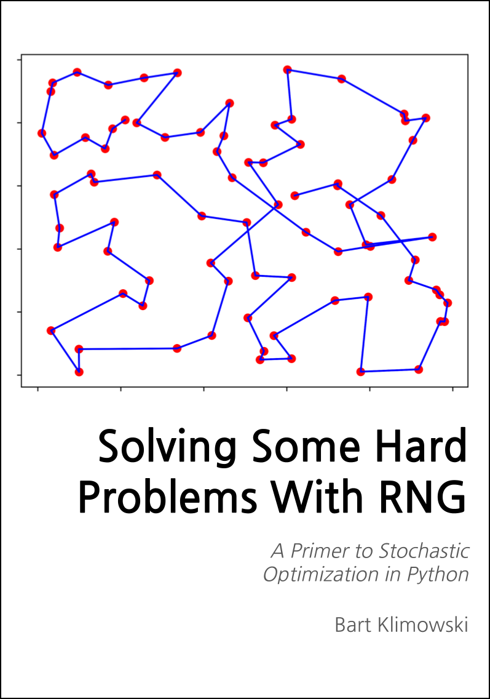

--- 
title: "Solving Some Hard Problems With RNG"
author: "Bart Klimowski"
date: "2021-12-03"
site: bookdown::bookdown_site
documentclass: book
bibliography: [book.bib, packages.bib]
# url: your book url like https://bookdown.org/yihui/bookdown
# cover-image: path to the social sharing image like images/cover.jpg
description: |
  This is a minimal example of using the bookdown package to write a book.
  The HTML output format for this example is bookdown::bs4_book,
  set in the _output.yml file.
biblio-style: apalike
csl: chicago-fullnote-bibliography.csl
monofont: "Fira Code"
always_allow_html: true
classoption: 
  - 10pt
  - openany
---

# Welcome {.unnumbered} 

 This is an online version of a open source book ***Solving Some Hard Problems With RNG: A Primer to Stochastic Optimization in Python***. 

The book covers range of method from the field of stochastic optimization/metaheuristics/black-box optimization.

## Resources 

Icons made by <a href="https://www.freepik.com" title="Freepik">Freepik</a> from <a href="https://www.flaticon.com/" title="Flaticon">www.flaticon.com</a>

# The Road Ahead {.unnumbered}

+ Solid python foundations - OOP, lambda functions and numpy.
+ A little bit more than high school math will be enough.

## What you will learn?

## What you will not learn?

## What should you know?

::: {.intro}
This is ***Introdction*** block which you will find at the beggining of every chapter. It will summarisze what will be covered in given piece. 
:::

::: {.summary}
This is ***Summary*** block 
Chapter recap:  

 + Nullam blandit ullamcorper purus, non 
 + faucibus turpis scelerisque vitae. Aenean molestie 
 + pharetra dui, vel vehicula nibh malesuada et. 
 + In hac habitasse platea dictumst. Etiam vel egestas sapien. Etiam convallis odio et elit bibendum, nec ullamcorper lacus rutrum. Aliquam erat volu
:::

::: {.diy}
This is ***DIY*** block suggested exercises and extensions of existing code.
:::

::: {.overthink}
This is ***Overthink*** block which will contain more in depth topics which will commonly require additional reading or googling.
:::

::: {.ask}
This is DIY block Lorem 
:::

## Roadmap
